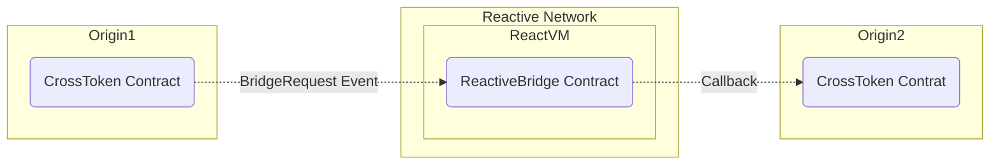

# Reactive Bridge

## Overview

This project illustrates a basic use case of the Reactive Network, showcasing a token bridge between two chains. The setup consists of a ERC20 token contract deployed on origin & destination chains, with a Reactive Contract managing the bridge between them. The Reactive Contract listens for events on both chains, emits logs, and triggers callbacks based on predefined conditions. For now, the demo only showcase A->B(Polygon to Sepolia) because, Sepolia is only destination chain supported by Reactive Network as of now. But, the Reactive contract is designed to support two-way token bridging(A->B and B->A).


### Features

- **Two-way Token Bridge:** This project supports two-way(A->B, B->A) token bridging between two chains. The Reactive Contract designed to listen for events on both chains and trigger callbacks to mint tokens on the destination chain. For now, the demo only showcase A->B(Polygon to Sepolia) because, Sepolia is only destination chain supported by Reactive Network as of now.

- **Intuitive UI:** The demo includes a simple UI(Uniswap's Swap like UI) to interact with the contracts. Users can request a bridge transfer from one chain to another by entering the amount of tokens to be bridged.

- **Realtime Updates:** The UI updates token balances in real-time to reflect the status of the bridge transfer. Users can track the progress of the bridge transfer, from the request to the bridging of tokens on the destination chain.



## Contracts

The demo involves two contracts. Can be found in `src/demos/token-bridge` directory:

1. **Origin & Destination Chain Contract:** `CrossToken.sol` is a Simple ERC20 token contract that can be deployed on both the origin and destination chains(called as origin1, origin2). It emits an event `BridgeRequest` when a user requests a bridge transfer from one chain to another. The event contains the user's address and the amount to be bridged.

2. **Reactive Contract:** `ReactiveBridge.sol` subscribes to events on both origin & destination, emits logs, and triggers callbacks when conditions are met, such as when `BridgeRequest` is emitted on the either of the chains, The callback is sent to the other chain with payload data to mint tokens on the destination chain. This contract is designed to support two-way token bridging(A->B and B->A). Right now, the demo only supports A->B because, Sepolia is only destination chain supported by Reactive Network.

## Getting Started

### Prerequisites

- [Node.js](https://nodejs.org/en/download/)

- [Foundry](https://book.getfoundry.sh/)

To set up foundry environment, run:

```bash
curl -L https://foundry.paradigm.xyz | bash
source ~/.bashrc
foundryup
```

- Etherem wallet with Some funds on origin and destination chains

To deploy contracts, follow these steps, making sure you substitute the appropriate keys, addresses, and endpoints where necessary. You will need the following environment variables configured appropriately to follow this script:

```.env
ORIGIN1_RPC=
ORIGIN2_RPC=
REACTIVE_RPC=
PRIVATE_KEY=
ORIGIN1_ADDR=
ORIGIN2_ADDR=
ORIGIN1_CHAINID=
ORIGIN2_CHAINID=
SYSTEM_CONTRACT_ADDR=
CALLBACK_SENDER_ADDR=
```

You can use the recommended Sepolia RPC URL: `https://rpc2.sepolia.org`.

Load the environment variables:

```bash
source .env
```

### Compile & Deploy Contracts

This project is scaffolded using Foundry, a smart contract development toolchain. Please refer to the [Foundry documentation](https://book.getfoundry.sh/) for more details.

Directory structure:

```bash
├── README.md
├── .env
├── lib # Foundry, OpenZeppelin, and other dependencies
├── src
│   ├── demos
│   │   └── token-bridge # Token Bridge Demo Contracts
│   │       ├── CrossToken.sol
│   │       └── ReactiveBridge.sol
├── frontend
```

Install dependencies and compile the contracts:

```bash
forge install

forge compile
```

Deploy the `CrossToken` contract with authorized callback sender on both chains(eg. Polygon & Sepolia) and assign the `Deployed to` address from the response to `ORIGIN1_ADDR` and `ORIGIN2_ADDR` respectively.

```bash
forge create --rpc-url $ORIGIN1_RPC --private-key $PRIVATE_KEY src/demos/token-bridge/CrossToken.sol:CrossToken --constructor-args 1000000000000000000000 $CALLBACK_SENDER_ADDR

forge create --rpc-url $ORIGIN2_RPC --private-key $PRIVATE_KEY src/demos/token-bridge/CrossToken.sol:CrossToken --constructor-args 1000000000000000000000 $CALLBACK_SENDER_ADDR
```

### Callback Payment

To ensure a successful callback, the callback contract(both origin1, origin2 contracts) must have an ETH balance. You can find more details [here](https://dev.reactive.network/system-contract#callback-payments). To fund the callback contracts, run the following command:

```bash
cast send $ORIGIN1_ADDR --rpc-url $ORIGIN1_RPC --private-key $PRIVATE_KEY --value 0.1ether

cast send $ORIGIN2_ADDR --rpc-url $ORIGIN2_RPC --private-key $PRIVATE_KEY --value 0.1ether
```

### Deploy Reactive Contract

Deploy the `ReactiveBridge.sol` (reactive contract), configuring it to listen to `BridgeRequest` event on both chains(origin1, origin2) and trigger a callback to the other chain with the payload data.

```bash
forge create --rpc-url $REACTIVE_RPC --private-key $PRIVATE_KEY src/demos/token-bridge/ReactiveBridge.sol:ReactiveBridge --constructor-args $SYSTEM_CONTRACT_ADDR $ORIGIN1_ADDR $ORIGIN2_ADDR $ORIGIN1_CHAINID $ORIGIN2_CHAINID
```

### Test the Bridge

Test the whole setup by sending a bridge request from origin1 to origin2(Should be Sepolia).

```bash
cast send --rpc-url $ORIGIN1_RPC --private-key $PRIVATE_KEY $ORIGIN1_ADDR "bridgeRequest(uint256)" 5000000000000000000
```

> **Note:** The bridge request callback should be on the destination chain(Sepolia) because the Reactive Network only supports Sepolia as the destination chain for now. So, Make sure you are calling `birdgeRequest` function from the other chain. (Not Sepolia). Adjust `ORIGIN1_ADDR` and `ORIGIN2_ADDR` accordingly in the above command.

This should trigger the callback on the destination chain(Sepolia) and mint the `amount` of tokens to the `caller` address on the destination chain.

### Deployed Contracts

- **CrossToken(XT) Contract(Polygon):** [0xd231fe46b4a8500d4add5ad98ec3c4ca56e7dee4](https://polygonscan.com/token/0xd231fe46b4a8500d4add5ad98ec3c4ca56e7dee4)
- **CrossToken(XT) Contract(Sepolia):** [0x3eed33dcf10ea9543380e71b9e245dca16c30605](https://sepolia.etherscan.io/token/0x3eed33dcf10ea9543380e71b9e245dca16c30605)
- **ReactiveBridge Contract:** [0x6d21161d1D17cDCA58707829E4d57D5a4EfE5489](https://kopli.reactscan.net/rvms/0xc7203561EF179333005a9b81215092413aB86aE9?screen=info)
- **RVM:** [0xc7203561EF179333005a9b81215092413aB86aE9](https://kopli.reactscan.net/rvms/0xc7203561EF179333005a9b81215092413aB86aE9)

### Running the Demo

> Copy the `frontend/.env.example` file to `frontend/.env` and update the environment variables accordingly. Update contract addresses in `frontend/src/utils/constants.js` file.

Install dependencies and start the frontend:

```bash
cd frontend

npm install

npm run dev
```

Open your browser and navigate to `http://localhost:3000` to view the demo.

### Demo

https://github.com/user-attachments/assets/803c6520-aedd-4be1-9d18-4057da0a2e1f


### Bridging Workflow

1. **Connect Wallet:** Connect your wallet to the frontend. Make sure you have some funds on Polygon.

2. **Mint Tokens:** Mint CrossToken(XT) on the origin chain(Polygon) by clicking the `Mint` button. This will mint 50 tokens to your address on the origin chain(Polygon) for demonstration purposes.

3. **Bridge Tokens:** Enter the amount of tokens to be bridged and click the `Bridge` button. This will trigger a bridge request from the origin chain(Polygon) burning them mount of tokens on origin(Polygon) and emitting a `BridgeRequest` event with the user's address and the amount to be bridged.

4. Reactive Contract listens for the `BridgeRequest` event on the origin chain(Polygon) and triggers a callback to the destination chain(Sepolia) with the event payload data to mint the amount of tokens to the user's address on the destination chain(Sepolia). The UI shows source and destination transaction links for tracking the progress of the bridge transfer.

5. The frontend updates the token balances in real-time to reflect the status of the bridge transfer.

#### Workflow Example

1. User mints 50 XT(CrossToken) on the origin chain(Polygon).
   https://polygonscan.com/tx/0xb34029deb89e48f2447a95a2240434f7055bac38e34a2ddaeafbd51fcca861f4

2. User requests to bridge 10 XT from the origin chain(Polygon) to the destination chain(Sepolia).
   https://polygonscan.com/tx/0x23552c280b0b40a5d426d4ca23858faa8d6ec26cb696d4c154e5c0e834ad8b02

3. Reactive Contract listens for the `BridgeRequest` event on the origin chain(Polygon) and triggers a callback to the destination chain(Sepolia) with the event payload data to mint 10 XT to the user's address on the destination chain(Sepolia).

https://kopli.reactscan.net/rvms/0xc7203561ef179333005a9b81215092413ab86ae9

4. Destination contract receives the callback and mints 10 XT to the user's address on the destination chain(Sepolia).
   https://sepolia.etherscan.io/tx/0xf767aa66dffbbc6330f640f31d1aa541cecce2c96b0bc8cdcd763469d00796eb

## Built With

- [Reactive Network](https://reactive.network) - Facilitates seamless cross-chain and multi-chain interactions, breaking down barriers for true blockchain interoperability.
- [Foundry](https://book.getfoundry.sh/) - A smart contract development toolchain. It provides a set of tools to help you build, test, and deploy smart contracts.
- [Solidity](https://docs.soliditylang.org/en/v0.8.24/) - Ethereum's smart contract programming language
- [Thirdweb](https://thirdweb.com) - Full-stack, open-source web3 development platform. Frontend, backend, and onchain tools to build complete web3 apps — on every EVM chain.
- [Antd](https://ant.design/) - A design system for enterprise-level products. Create an efficient and enjoyable work experience.
- [React + Vite](https://vitejs.dev/) - Frontend development environment for building fast and modern web apps

## Safety & Security

This is experimental software and subject to change over time.

This is a proof of concept and is not ready for production use. It is not audited and has not been tested for security. Use at your own risk. I do not give any warranties and will not be liable for any loss incurred through any use of this codebase.

## License

This project is licensed under the MIT License - see the [LICENSE](LICENSE) file for details.
