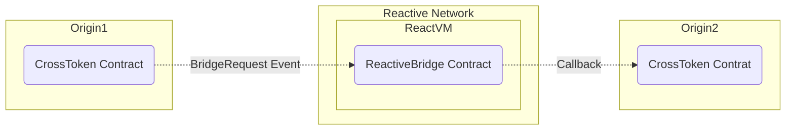

# Crosschain Lending

## Overview

This project illustrates a basic use case of the Reactive Network, showcasing a cross-chain lending scenario. The demo involves three contracts, one each for the origin chain(Polygon), destination chain(Sepolia), and a Reactive Contract that listens for events on both chains and triggers callbacks to facilitate cross-chain interactions. The demo allows users to deposit collateral on the origin chain(Polygon) to request a loan on the destination chain(Sepolia). The Reactive Contract listens for the `CollateralDeposited` event on the origin chain(Polygon) and triggers a callback to the destination chain(Sepolia) to issue the loan amount to the user's address on the destination chain(Sepolia). Users can repay the total loan amount at once or in installments. The Reactive Contract listens for the `LoanRepaid` event on the destination chain(Sepolia) and triggers a callback to the origin chain(Polygon) to release the collateral to the user's address on the origin chain(Polygon).


### Features

- **Collateral Management:** Users can deposit collateral on the origin chain(Polygon) to request a loan on the destination chain(Sepolia). The Reactive Contract listens for the `CollateralDeposited` event on the origin chain(Polygon) and triggers a callback to the destination chain(Sepolia) to issue the loan amount to the user's address on the destination chain(Sepolia).

- **Loan Repayment:** Users can repay the total loan amount at once or in installments. The Reactive Contract listens for the `LoanRepaid` event on the destination chain(Sepolia) and triggers a callback to the origin chain(Polygon) to release the collateral to the user's address on the origin chain(Polygon).

- **Intuitive UI:** The demo includes a simple UI(Uniswap's Swap like UI) to interact with the contracts. Users can request a bridge transfer from one chain to another by entering the amount of tokens to be bridged.

- **Realtime Updates:** The UI updates token balances in real-time to reflect the status of the bridge transfer. Users can track the progress of the bridge transfer, from the request to the bridging of tokens on the destination chain.



## Contracts

The demo involves three contracts. Can be found in `src/crosschain-lending` directory:

1. **CollateralManager(Origin) Contract:** `CollateralManager.sol` This contract allows users to deposit collateral on the origin chain(Polygon) to request a loan on the destination chain(Sepolia). It emits a `CollateralDeposited` event when a user deposits collateral. The event contains the user's address and the amount of collateral deposited. The contract also has a `releaseCollateral` function that releases the collateral to the user's address on the origin chain(Polygon) when called by authorized callback proxy contract.

2. **CrossLoan Contract(Destination):** `CrossLoan.sol` This Contract issues loan on the destination chain(Sepolia) to the user's address when triggered by the Reactive Contract. It also allows users to repay the total loan amount at once or in installments. The contract emits a `LoanRepaid` event when a user repays the loan amount. The event contains the user's address and the amount of loan repaid in which triggers a callback to the origin chain(Polygon) to release the collateral to the user's address on the origin chain(Polygon).

3. **CrossLoanReactor:** `CrossLoanReactor.sol` is a Reactive Contract that listens for the `CollateralDeposited` event on the origin chain(Polygon) and triggers a callback to the destination chain(Sepolia) to issue the loan amount to the user's address on the destination chain(Sepolia). It also listens for the `LoanRepaid` event on the destination chain(Sepolia) and triggers a callback to the origin chain(Polygon) to release the collateral to the user's address on the origin chain(Polygon).

## Getting Started

### Prerequisites

- [Node.js](https://nodejs.org/en/download/)

- [Foundry](https://book.getfoundry.sh/)

To set up foundry environment, run:

```bash
curl -L https://foundry.paradigm.xyz | bash
source ~/.bashrc
foundryup
```

- Etherem wallet with Some funds on origin and destination chains

To deploy contracts, follow these steps, making sure you substitute the appropriate keys, addresses, and endpoints where necessary. You will need the following environment variables configured appropriately to follow this script:

```.env
ORIGIN_RPC=
DESTINATION_RPC=
REACTIVE_RPC=
PRIVATE_KEY=
ORIGIN_ADDR=
DESTINATION_ADDR=
ORIGIN_CHAINID=
DESTINATION_CHAINID=
SYSTEM_CONTRACT_ADDR=
CALLBACK_SENDER_ADDR=
```

You can use the recommended Sepolia RPC URL: `https://rpc2.sepolia.org`.

Load the environment variables:

```bash
source .env
```

### Compile & Deploy Contracts

This project is scaffolded using Foundry, a smart contract development toolchain. Please refer to the [Foundry documentation](https://book.getfoundry.sh/) for more details.

Directory Structure:

````bash
.
├── README.md
├── frontend
├── lib # Foundry library
├── src
│    ├── crosschain-lending # Crosschain lending contracts
│         ├── CollateralManager.sol
│         ├── CrossLoan.sol
│         ├── CrossLoanReactor.sol


Install dependencies and compile the contracts:

```bash
forge install

forge compile
````

Deploy the `CollateralManager` contract with authorized callback sender on origin(i.e Polygon) and assign the `Deployed to` address from the response to `ORIGIN_ADDR`.

```bash
forge create --rpc-url $ORIGIN_RPC --private-key $PRIVATE_KEY src/crosschain-lending/CollateralManager.sol:CollateralManager --constructor-args $CALLBACK_SENDER_ADDR
```

Deploy the `CrossLoan` contract with authorized callback sender on destination(i.e. Sepolia) and assign the `Deployed to` address from the response to `DESTINATION_ADDR`.

```bash
forge create --rpc-url $DESTINATION_RPC --private-key $PRIVATE_KEY src/crosschain-lending/CrossLoan.sol:CrossLoan --constructor-args $CALLBACK_SENDER_ADDR
```

### Callback Payment

To ensure a successful callback and issue loans, the callback contract(both origin, destination contracts) must have an ETH balance. You can find more details [here](https://dev.reactive.network/system-contract#callback-payments). To fund the callback contracts, run the following command:

```bash
cast send $ORIGIN_ADDR --rpc-url $ORIGIN_RPC --private-key $PRIVATE_KEY --value 0.1ether

cast send $DESTINATION_ADDR --rpc-url $DESTINATION_RPC --private-key $PRIVATE_KEY --value 0.4ether # More funds required for issuing loans
```

### Deploy Reactive Contract

Deploy the `CrossLoanReactor.sol` (reactive contract), configuring it to listen to `CollateralDeposited` event on origin contract and `LoanRepaid` event on destination contract, Triggering respective callbacks(to either origin or destination contracts).

```bash
forge create --rpc-url $REACTIVE_RPC --private-key $PRIVATE_KEY src/crosschain-lending/CrossLoanReactor.sol:CrossLoanReactor --constructor-args $SYSTEM_CONTRACT_ADDR $ORIGIN_ADDR $DESTINATION_ADDR $ORIGIN_CHAINID $DESTINATION_CHAINID
```

### Test the Setup

To test the setup, deposit some collateral on the origin chain(Polygon).

```bash
cast send --rpc-url $ORIGIN_RPC --private-key $PRIVATE_KEY $ORIGIN_ADDR "depositCollateral(uint256)" 50000000000000000
```

> **Note:** Destination contract should be deployed on Sepolia chain and should have enough funds to issue loans.

This should trigger a callback to the destination chain(Sepolia) to issue loan amount to the caller address on the destination chain.

### Deployed Contracts

- **CollateralManager(Origin):** [0x0dd2c234bcd5c3a8da28176cb69949289c926e39](https://sepolia.etherscan.io/address/0x0dd2c234bcd5c3a8da28176cb69949289c926e39)
- **CrossLoan(Destination):** [0x50be96d76f30ab81d2c17529859c483cc90b5673](https://sepolia.etherscan.io/address/0x50be96d76f30ab81d2c17529859c483cc90b5673)
- **CrossLoanReactor Contract:** [0xbbf700909f861a0fa1ea7c53f330e05a67e1505](https://kopli.reactscan.net/rvms/0xc7203561EF179333005a9b81215092413aB86aE9?screen=info)
- **RVM:** [0xc7203561EF179333005a9b81215092413aB86aE9](https://kopli.reactscan.net/rvms/0xc7203561EF179333005a9b81215092413aB86aE9)

### Crosschain Lending Workflow
